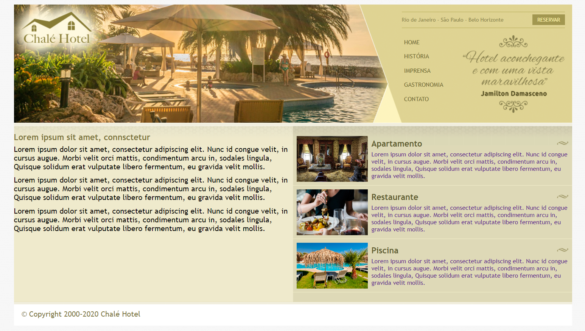
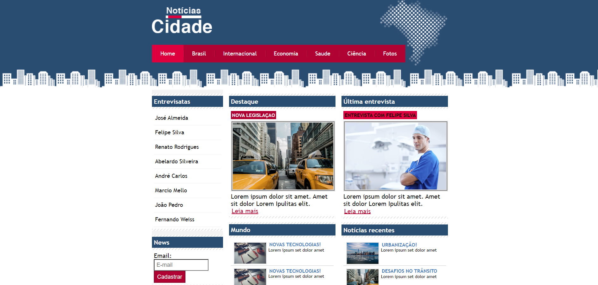
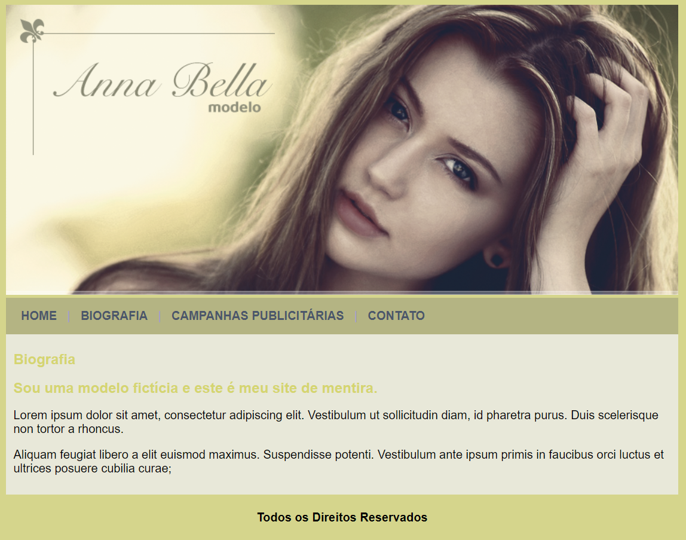

# Projetos HTML e CSS

Alguns Projetos em HTML usando a folha de estilo CSS do Curso "Desenvolvimento Web Completo" ministrados por Jamilton Damasceno e Jorge Sant Ana

Todos os Sites são fictícios e foram criado apenas para treinar as habilidades de HTML e CSS

## Imagens dos Projetos

